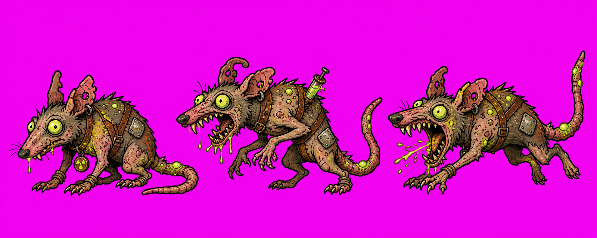

# Art Style Reference

**Canonical style name:** Rick-and-Morty-like Offbeat Adult Sci-Fi Cartoon Wasteland
**Owner shorthand:** "Rick and Morty style" is the active art direction: broad adult sci-fi animation energy, rubbery dark outlines, flat color blocks, absurd proportions, weird sci-fi comedy, and readable cartoon silhouettes. Keep every design original: do not copy named characters, exact show designs, logos, or proprietary story elements.
**Approved reference:** `docs/art/rick-morty-radiation-rat-style-reference.png`, chosen by the project owner on 2026-05-31.
**Ground truth:** the approved radiation rat reference image above is now the visual source of truth for the whole project. When older docs, previous sprites, Cowboy Bill references, or historical prompt logs conflict with this document, this document wins.
**Current Cowboy Bill reference:** `docs/art/current-cowboy-bill-style-reference.png`. Use this for Bill's current identity and card-scene treatment; do not use older standalone Cowboy Bill renders as a style or identity reference.



This is the source of truth for visual direction. New art should feel like an original Rick-and-Morty-like adult sci-fi cartoon wasteland game: rubbery black outlines, flat bright color blocks, simple readable shading, exaggerated weird proportions, sickly radioactive greens, grimy wasteland salvage details, and a strange comic tone. The project is no longer constrained to the old 128-pixel sprite-art direction, and older standalone Cowboy Bill renders must not be used as references.

## Core Look

- **Medium:** clean 2D cartoon game art with crisp edges, heavy dark outlines, flat color planes, and simple cel shading. It should read like a strange adult sci-fi animation screenshot adapted into game assets.
- **Resolution policy:** asset dimensions such as 128x128, 192x192, 256x256, or 512x320 are only engine output sizes. They are never a prompt style, rendering style, brush style, or pixel-art restriction.
- **Shape language:** exaggerated, asymmetrical, and readable. Characters can have bulging eyes, lanky limbs, warped bodies, oversized teeth, awkward silhouettes, and slightly absurd mutant or mechanical details.
- **Linework:** thick black or very dark brown outlines with confident interior contour lines. Avoid thin realistic hairlines and avoid sketchy over-rendering.
- **Shading:** simple two-to-three value cel shading. Use clean shadow shapes to clarify volume; do not over-render fur, metal, leather, or scratches.
- **Materials:** mutant skin, patchy fur, dusty leather, brass cuffs, dented steel, cheap sci-fi sensors, exposed springs, cracked glass, patched cloth, rubber hoses, improvised junk-tech, and radioactive slime.
- **Palette:** sickly radioactive green and yellow-green accents over dusty tan, dirty pink skin, leather brown, rust, brass, dark steel, and occasional cyan or magenta.
- **Accent color:** toxic green is the primary world accent. Use one or two small high-contrast glowing details per character or item; the glow should support readability, not flood the sprite.
- **Mood:** weird, comic, dangerous, and wasteland-western. Keep the game harsh enough for combat, but embrace absurd sci-fi cartoon personality.
- **Background policy:** sprites, cards, relics, equipment, UI icons, and FX should be generated on solid `#FF00FF` for cleanup or delivered as transparent PNGs. Scene backgrounds may be full-scene images without UI baked in.

## Character Reference Rules

### Primary Style Standard - Radiation Rat

- The radiation rat reference is the project-wide style standard.
- Key traits to copy across future assets: rubbery black outlines, flat bright fills, simple cel shading, bulging expressive eyes, gross-comic proportions, toxic green radioactive accents, and clean animation-like readability.
- The three-pose sheet is a style reference, not a final sliced animation contract. For production enemies, still generate clean contained frames at the required output size.

### Cowboy Bill

- Robot cowboy hero.
- Exactly **one** large orange camera eye. No second eye, no paired human eyes.
- Oversized cowboy hat with star badge, red scarf, patched duster or poncho, large boots, belt pouches, and a salvaged revolver.
- Mechanical face can be simplified into a tube, canister, or mask shape, but the single orange eye must remain the read.
- Combat hero frames face right.
- Use `docs/art/current-cowboy-bill-style-reference.png` as the current Bill reference. When Cowboy Bill is regenerated, preserve the identity markers above and match the flatter radiation-rat style. Do not use older Bill renders.

### Enemies

- Enemies should feel like original junk-tech cartoon creatures, radiation mutants, drones, or robots.
- Use strong silhouette comedy: bulging eyes, huge teeth, too many legs, tiny body with huge jaw, giant shield on small legs, oversized weapon, crooked antenna, glowing pustules, or awkward welded parts.
- Enemies face left in combat.
- Avoid making enemies too painterly or realistic; they should sit next to the radiation rat reference.

## Prompt Anchor

Use this prompt anchor for generated character, enemy, relic, card, and UI icon assets:

```text
original offbeat adult sci-fi cartoon wasteland game art, Rick-and-Morty-like broad adult sci-fi animation energy without copying named characters or exact show designs, thick dark rubbery outlines, flat bright color blocks, simple cel shading, exaggerated asymmetrical proportions, bulging expressive eyes, weird mutant or junk-tech silhouette, dusty western leather and brass, dented steel, exposed springs, patched cloth, radioactive slime, one or two small toxic-green glowing accents, crisp sprite-ready edges, solid #FF00FF magenta background for cleanup or transparent final PNG, no text, no UI frame, no logo
```

For combat unit sheets, add:

```text
side view full body, shared baseline, consistent scale, hero faces right or enemy faces left, 4 attack frames, attack frame 0 doubles as the static rest pose, no separate idle animation, contained inside each frame with safe margins
```

For card illustrations, keep the same style but do not force side-view/full-body if the card art is an object, weapon, or action scene. Card art must not include card frames, cost badges, titles, labels, or UI elements.

## Avoid

- Directly copying copyrighted characters, named show characters, logos, or exact show-specific designs.
- The previous high-detail rendered sprite look as the target for new art.
- Old prompt language that treats asset dimensions as a visual style. Use the current cartoon anchor instead of earlier sprite-art anchors.
- Photorealistic lighting, realistic military hard-surface rendering, glossy clean sci-fi, or serious concept-art mechs.
- Dense scratch/noise texture that hides the cartoon silhouette.
- UI text baked into art, card frames baked into card art, or background scenes behind item-only icons.
