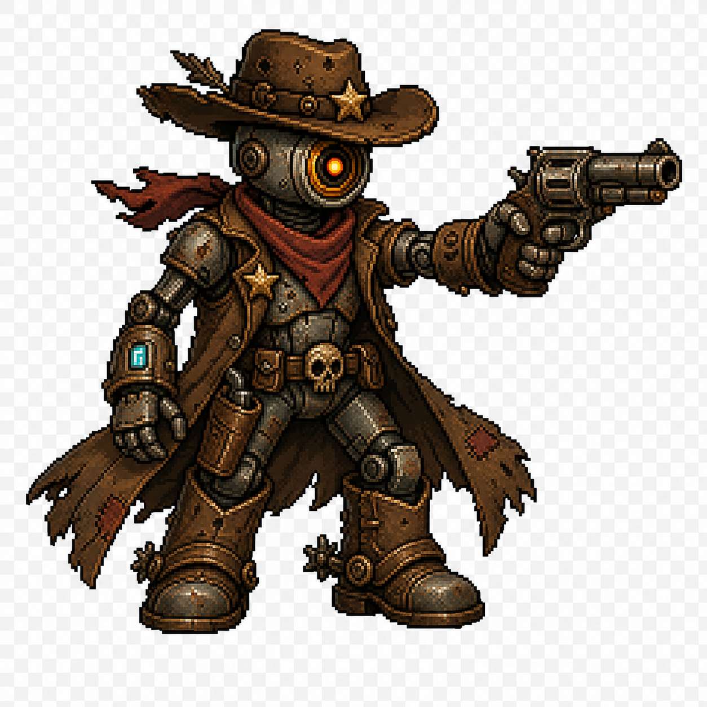

# Art Style Reference

**Canonical style name:** Hardcore 128 Pixel Wasteland Art
**Approved reference:** `docs/art/hardcore-128-pixel-wasteland-reference.png`, chosen by the project owner on 2026-05-19.



This is the source of truth for visual direction. New art should look like it belongs in the same world as this reference: gritty 128-native pixel characters with strong silhouettes, black pixel outlines, rusty wasteland materials, and sparse neon accents.

## Core Look

- **Native resolution:** combat characters and enemies are designed on a 128x128 pixel-art canvas unless a spec explicitly marks a larger boss scale.
- **Shape language:** readable, compact, and tough. Silhouettes may be stylized, but they should feel hardcore and battle-ready rather than soft toy-like.
- **Linework:** bold black pixel outlines with deliberate pixel clusters. Avoid thin realistic lines and avoid high-resolution cartoon brushwork.
- **Shading:** controlled pixel shading with readable highlight/mid/shadow clusters. Avoid noisy dithering that muddies the silhouette.
- **Materials:** rusted scrap metal, worn leather, patched cloth, bolts, dents, tubes, tape, cracked glass, oil stains, and salvaged weapon parts.
- **Palette:** warm wasteland base: leather brown, rust orange, dusty tan, muted olive, dark steel, faded brass, and desaturated charcoal.
- **Accent color:** one small high-contrast accent per character or item, such as toxic green, cyan, amber, or red sensor light.
- **Mood:** harsh, tactical, and scrapyard-hardened. The designs can stay readable and appealing, but they should not become cute mascot art.

## Character Reference Rules

### Cowboy Bill

- Robot cowboy hero.
- Exactly **one** large central camera eye. No second eye, no paired human eyes.
- Oversized battered cowboy hat, red bandana, patched duster or poncho, chunky boots, and a salvaged revolver or hand cannon.
- Faces right in combat.
- Should read as a gritty wasteland gunslinger with clear 128-pixel readability.

### Trash Bot

- Small trash-collecting robot enemy.
- Compact trash-bin, compactor, or tracked junk body.
- Camera-eye face, tiny tank treads or scrap wheels, stubby grabber arms, dents, tape, bolts, and a small neon status light.
- Faces left in combat.
- Should feel like an original scrapyard enemy, not a copy of any existing robot character.

## Prompt Anchor

Use this prompt anchor for generated character, enemy, relic, card, and UI icon assets:

```text
hardcore 128 pixel wasteland art style, native 128x128 pixel game sprite readability, bold black pixel outlines, gritty rusted scrap metal, worn leather and patched cloth, dusty desert palette, controlled pixel shading, salvaged bolts dents tubes and cracked glass, one small neon accent, transparent background, no high-resolution cartoon brushwork
```

For combat unit sheets, add:

```text
side view, full body, shared baseline, consistent scale, hero faces right or enemy faces left, 4 attack frames, attack frame 0 doubles as the static rest pose, no separate idle animation
```

For card illustrations, keep the same style but do not force side-view/full-body if the card art is an object, weapon, or action scene.

## Avoid

- Directly copying or imitating copyrighted characters or named IP styles.
- Clean futuristic sci-fi, glossy mechs, realistic military hardware, or hard-surface concept art.
- High-resolution cartoon, vector, painterly, or cel-shaded output that does not read as pixel art.
- Tiny lo-fi 16x16 or 32x32 sprites that lose the 128-pixel detail budget.
- Dense pixel noise that makes the silhouette unreadable.
- Pure minimalist line art without wasteland material texture.
- Cute mascot proportions that undermine the hardcore wasteland tone.
